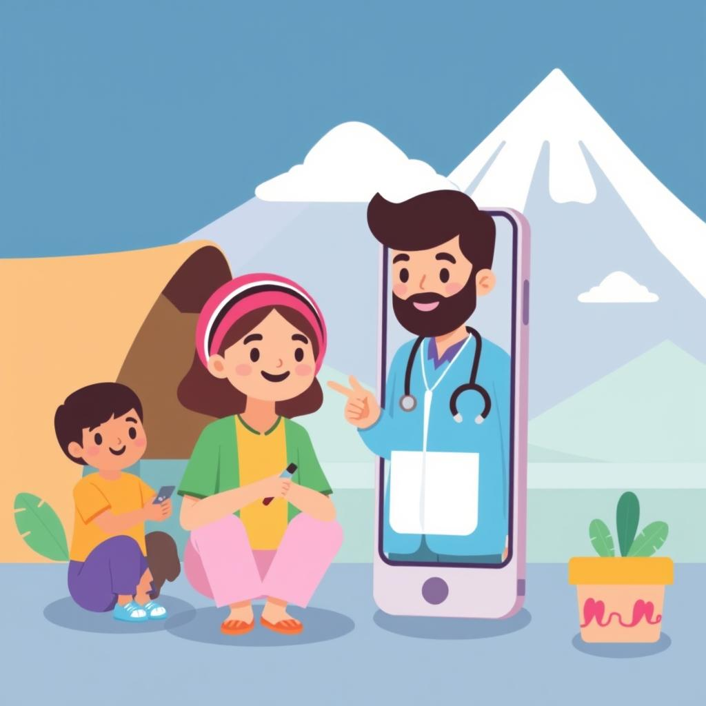
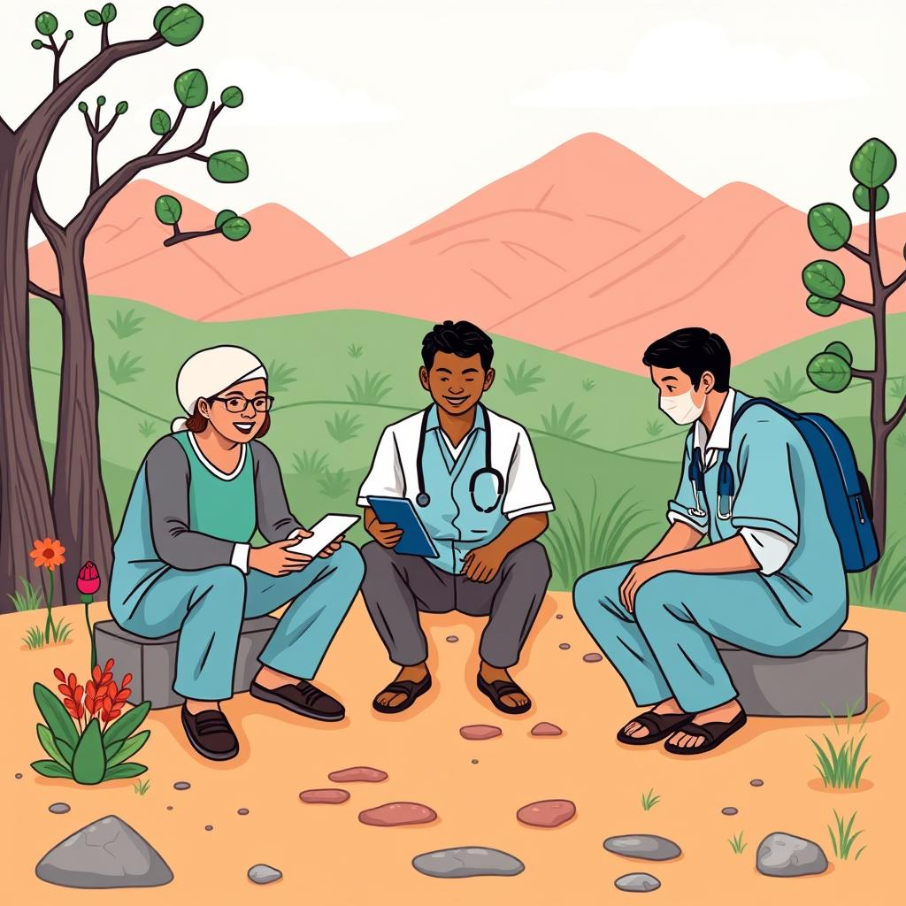

# MedOffLine ✨

Asistente Médico Offline para Comunidades Remotas


## Introduccion


MedOffLine es un asistente de inteligencia artificial ligero, basado en los modelos Llama, que brinde orientación médica básica en comunidades sin acceso a internet. El sistema podría funcionar en dispositivos móviles de bajo costo y ofrecer:

## Funcionalidades clave

* Diagnósticos preliminares basados en síntomas.
* Guías de primeros auxilios.
* Información sobre medicamentos básicos (dosis, efectos secundarios).
* Orientación sobre cuándo y dónde buscar ayuda médica.
* Material educativo sobre prevención de enfermedades comunes.

## El Problema


Relevancia social:

Venezuela y muchas regiones de América Latina enfrentan graves problemas de acceso a la salud, especialmente en zonas rurales. Este proyecto resuelve una necesidad básica y urgente.

## Impacto directo y medible


Se podría medir el impacto por el número de personas atendidas, consultas realizadas y casos críticos identificados.

Su implementación podría reducir las complicaciones de salud prevenibles.
<br/>
<br/>

## Por qué este proyecto tiene alta viabilidad


* Uso eficiente de tecnología:

Llama 3.2 es ideal porque incluye modelos ligeros que pueden funcionar en dispositivos móviles con recursos limitados, incluso sin conexión a internet.

* Escalabilidad:

Puede ampliarse a otros países o regiones con desafíos similares.
Podría traducirse a lenguas indígenas o adaptarse a contextos específicos.

* Viabilidad técnica y económica:

No requiere hardware sofisticado ni infraestructura costosa.
Puede financiarse mediante asociaciones con ONGs, gobiernos locales o iniciativas de salud pública.

<hr>

# MedOffLine ✨

Offline Medical Assistant for Remote Communities



## Introduction


MedOffLine is a cutting-edge application designed to revolutionize the real estate market by simplifying the process for both buyers and sellers. Utilizing an advanced AI  Assistant technology, the app offers a conversational interface where users can enter their real estate preferences and requirements.

## Key Features

* Preliminary diagnostics based on symptoms.
* First aid guides.
* Information on basic medications (dosages, side effects).
* Guidance on when and where to seek medical assistance.
* Educational materials on preventing common illnesses.

## The Problem



Social Relevance:

Colombia, Venezuela and many regions across Latin America face significant healthcare access challenges, especially in rural areas. This project addresses a critical and urgent need.

## Direct and Measurable Impact


The impact could be measured by the number of people served, consultations performed, and critical cases identified.

Its implementation could help reduce preventable health complications.
<br/><br/>

## Why this project is highly viable


Efficient Use of Technology:

Llama 3.2 is an ideal choice as it includes lightweight models capable of running on resource-limited mobile devices, even without internet connectivity.

Scalability:

The solution can be expanded to other countries or regions facing similar challenges.
It could be translated into indigenous languages or adapted to specific cultural contexts.

Technical and Economic Feasibility:

The project does not require sophisticated hardware or costly infrastructure.
It can be funded through partnerships with NGOs, local governments, or public health initiatives.

## Technology Used

* Meta Llama models: 3.2 1B/3B, Llama 3.1 70B
* MongoDB Atlas
* Executorch
* Java
* Python
* Streamlit
* GenericSuite
* AI/ML API or Sambanova

## Getting Started

### Prerequisites

- [Python](https://www.python.org/downloads/) 3.10 or higher
- [Git](https://www.atlassian.com/git/tutorials/install-git)
- Make: [Mac](https://formulae.brew.sh/formula/make) | [Windows](https://stackoverflow.com/questions/32127524/how-to-install-and-use-make-in-windows)

### Installation

Clone the repository:
```bash
git clone https://github.com/tomkat-cr/medoffline.git
```

Navigate to the project directory:

```bash
cd medoffline
```

<!--
### Create the .env file

Create a `.env` file in the root directory of the project:

```bash
# You can copy the .env.example file in the root directory of the project
cp .env.example .env
```

The `.env` file should have the following content:

```bash
PYTHON_VERSION=3.10
#
# Together AI
TOGETHER_AI_API_KEY=
# OpenAI
OPENAI_API_KEY=
#
# Database parameters
DB_TYPE=mongodb
# DB_TYPE=json
#
# MongoDB database parameters
MONGODB_URI=mongodb+srv://<user>:<password>@<cluster>.mongodb.net
MONGODB_DB_NAME=MedOffLine-dev
#
# JSON database parameters
# JSON_DB_PATH=./db/conversations.json
```

Replace `TOGETHER_AI_API_KEY` and other access tokens with your actual Together.ai API key, OpenAI, Huggingface, Groq, Nvidia, and Rhymes API keys, respectively.

To use a MongoDB database, comment out `DB_TYPE=json`, uncomment `# DB_TYPE=mongodb`, and replace `YOUR_MONGODB_URI`, `YOUR_MONGODB_DB_NAME`, and `YOUR_MONGODB_COLLECTION_NAME` with your actual MongoDB URI, database name, and collection name, respectively.
-->

### Run the Application

```bash
# With Make
make run
```

```bash
# Without Make
sh ./public/scripts/run_app.sh run
```

## Usage

Go to your favorite Browser and open the URL provided by the application.

* Locally:<BR/>
  [http://localhost:8503/](http://localhost:8503/)

* Official App:<BR/>
  [https://medoffline.streamlit.app/](https://MedOffLine.streamlit.app/)

## Screenshots

Main Page


Main Page with IBM watsonx assistan opened


## Context

This project was developed as part of the [Llama Impact Pan-LATAM Hackathon](https://lablab.ai/event/hackathon-llama-impact-pan-latam-es) organized by [Lablab.ai](https://lablab.ai).


- Project submission page: [MedOffLine](https://lablab.ai/event/hackathon-llama-impact-pan-latam-es/the-fynbots/medoffline)

- Presentation video: [Llama Impact Pan-LATAM Hackathon - MedOffLine App Video Presentation](https://lablab.ai/event/hackathon-llama-impact-pan-latam-es/the-fynbots/medoffline)

<!--
- Presentation document: [Llama Impact Pan-LATAM Hackathon - MedOffLine App Maker Presentation](https://storage.googleapis.com/lablab-static-eu/presentations/submissions/xxx.pdf)
-->

- Team: [The FynBots](https://lablab.ai/event/hackathon-llama-impact-pan-latam-es/the-fynbots)

## Contributors

[Carlos J. Ramirez](https://www.linkedin.com/in/carlosjramirez/) | [Omar Tobon](https://www.linkedin.com/in/omar-tobon/)

Please feel free to suggest improvements, report bugs, or make a contribution to the code.

## License

This project is licensed under the terms of the MIT license. See the [LICENSE](LICENSE) file for details.

## Acknowledgements

* [AI at Meta](https://ai.meta.com/) for developing the Llama powerful models and technology.
* [Lablab.ai](https://lablab.ai) for organizing the [Llama Impact Pan-LATAM Hackathon](https://lablab.ai/event/hackathon-llama-impact-pan-latam-es).
* Open-source community for inspiring and supporting collaborative innovation.
* Users and contributors for their feedback and support.

<br/><br/>
<center>


</center>

