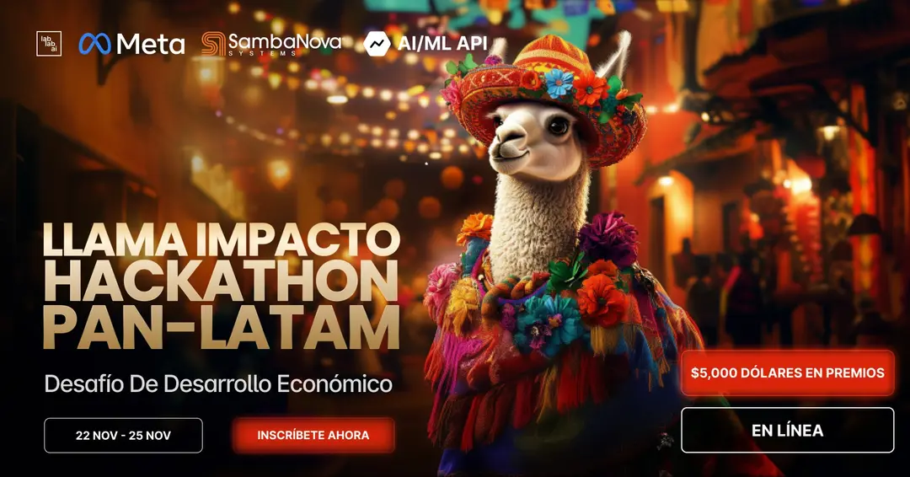

# MedOffLine ✨

Asistente de IA Offline para Comunidades Remotas | 🇻🇪 🇨🇴


## Descripción


MedOffLine es un Asistente de IA (Inteligencia Artificial) enfocado a ofrecer orientación de primeros auxilios básicos en comunidades con acceso limitado o sin acceso a Internet.

El sistema funciona en dispositivos móviles Android de mediano costo y usa los [modelos ligeros Llama 3.2 1B/3B de Meta](https://www.llama.com/).

## El Problema


El acceso a la salud es un desafío en comunidades rurales debido a:

* Conectividad limitada.
* Barreras geográficas.
* Escasez de servicios médicos.

## Solución


MedOffLine ofrece una solución 100% offline, ligera y culturalmente inclusiva, proporcionando.

* Guías de primeros auxilios.
* Diagnósticos preliminares basados en síntomas.
* Información sobre medicamentos básicos (dosis, efectos secundarios).
* Orientación sobre cuándo y dónde buscar ayuda médica.
* Material educativo sobre prevención de enfermedades comunes.

## Impacto directo y medible


Se podría medir el impacto por el número de personas atendidas, consultas realizadas y casos críticos identificados.

Su implementación podría reducir las complicaciones de salud prevenibles.
<BR/>
<BR/>

## Por qué este proyecto tiene alta viabilidad


Uso eficiente de tecnología:

* Llama 3.2 es ideal porque incluye modelos ligeros que pueden funcionar en dispositivos móviles con recursos limitados, incluso sin conexión a internet.

Escalabilidad:

* Puede ampliarse a otros países o regiones con desafíos similares.

* Podría traducirse a lenguas indígenas o adaptarse a contextos específicos.

Viabilidad técnica y económica:

* No requiere hardware sofisticado ni infraestructura costosa.

* Puede financiarse mediante asociaciones con ONGs, gobiernos locales o iniciativas de salud pública.

## Uso

1. Entrar en el sitio web: [https://medoffline.streamlit.app](https://medoffline.streamlit.app)<BR/><BR/>
   

2. Hacer clic en el botón Descargar APK.

3. Esperar que la descarga termine.

4. Ir a **Descargas** en el menú del navegador y tocar el archivo medoffline.apk.

5. Buscar el icono de la App **MedOffline** y tocarlo.

6. La primera vez la App hará la descarga del modelo inicial, lo cual tomara cerca de 3 minutos. Disculpe la espera ;)

7. Una vez terminada la descarga, aparece la pantalla principal con una interfaz de usuario tipo Chatbot.<BR/><BR/>
   

## Tecnología utilizada

* [Modelos de Meta Llama: 3.2 1B/3B, y 3.1 70B](https://www.llama.com/llama-downloads)
* [Pytorch Executorch](https://github.com/pytorch/executorch)
* [Java](https://developer.android.com/build/jdks)
* [Python](https://www.python.org)
* [Streamlit](https://streamlit.io)
* [Kaggle](https://www.kaggle.com/models/tomkatcr/llama3.2_3b_pte)
* [Github](https://github.com)

### Para el diseño gráfico y la programación

* [Canva](https://www.canva.com/)
* [ChatGPT / Dall-E](https://chatgpt.com/)
* [Flux.1](https://flux-ai.io/)
* [Github Copilot](https://github.com/features/copilot)

## Contexto

Este proyecto fue desarrollado como parte del [Llama Impact Pan-LATAM Hackathon](https://lablab.ai/event/hackathon-llama-impact-pan-latam-es) organizado por [Lablab.ai](https://lablab.ai).

 

Submission page:

[https://lablab.ai/event/hackathon-llama-impact-pan-latam-es/the-fynbots/medoffline](https://lablab.ai/event/hackathon-llama-impact-pan-latam-es/the-fynbots/medoffline)

Recursos:

* Sitio Web:<BR/>
  [https://medoffline.streamlit.app](https://medoffline.streamlit.app)

* Código Fuente:<BR/>
  [https://github.com/tomkat-cr/medoffline](https://github.com/tomkat-cr/medoffline)

* Modelos en Kaggle:<BR/>
  [https://www.kaggle.com/models/tomkatcr/llama3.2_3b_pte](https://www.kaggle.com/models/tomkatcr/llama3.2_3b_pte)

* Video-presentación:<BR/>
  [https://youtu.be/R-rAKMbKVus?si=KbJgHZFg4J4f8BXX](https://youtu.be/R-rAKMbKVus?si=KbJgHZFg4J4f8BXX)

* Documento de la presentación: [PDF](https://storage.googleapis.com/lablab-static-eu/presentations/submissions/cm3xdpe8l00113b713e90gmb5/cm3xdpe8l00113b713e90gmb5-1732561102890_zq1alr0cwl.pdf)

* Página del equipo: [The FynBots](https://lablab.ai/event/hackathon-llama-impact-pan-latam-es/the-fynbots)

## El Equipo de Trabajo

[The FynBots](https://lablab.ai/event/hackathon-llama-impact-pan-latam-es/the-fynbots)


* Omar Tobón | [Linkedin](https://www.linkedin.com/in/omar-tobon) | 🇨🇴 | Creativo, coach.<BR/><BR/>
  Generación de la idea, generación IA de imágenes, desarrollo del namimg, curaduría de datasets para fine-tuning de modelos, diseño y producción de la presentación, manejo de la inteligencia emocional y coaching del equipo.

* Carlos J. Ramírez | [Linkedin](https://www.linkedin.com/in/carlosjramirez) | 🇻🇪 | Arquitecto de software, líder técnico.<BR/><BR/>
  Codificación del prototipo para Android, conversion de los modelos Llama 3.2 al formato de Pytorch Executor (`.pte`), publicación de los modelos en Kaggle, diseño del sitio web, despliegue de la aplicación y el sitio web, manejo del equipo en la plataforma de lablab.ai, producción de la video-presentación. 

<BR/>
<hr>
<hr>
<BR/>

# MedOffLine ✨

**Offline AI Assistant for Remote Communities | 🇻🇪 🇨🇴**


## Description


MedOffLine is an AI Assistant designed to provide basic first aid guidance in communities with limited or no Internet access.

The system runs on mid-range Android mobile devices and uses [Meta's lightweight Llama 3.2 1B/3B models](https://www.llama.com/).

## The Problem


Access to healthcare is a challenge in rural communities due to:

* Limited connectivity.
* Geographic barriers.
* Scarcity of medical services.

## Solution


MedOffLine offers a 100% offline, lightweight, and culturally inclusive solution, providing:

* First aid guides.
* Preliminary diagnostics based on symptoms.
* Information on basic medications (dosages, side effects).
* Guidance on when and where to seek medical help.
* Educational material on preventing common diseases.

## Direct and Measurable Impact


Impact can be measured by the number of people assisted, consultations performed, and critical cases identified.

Its implementation could reduce preventable health complications.
<BR/>
<BR/>

## Why This Project is Highly Viable


**Efficient Use of Technology**:
* Llama 3.2 is ideal because it includes lightweight models capable of running on resource-limited mobile devices, even offline.

**Scalability**:
* It can be expanded to other countries or regions facing similar challenges.
* It could be translated into indigenous languages or adapted to specific contexts.

**Technical and Economic Feasibility**:
* Does not require sophisticated hardware or expensive infrastructure.
* Can be funded through partnerships with NGOs, local governments, or public health initiatives.

## Usage

1. Visit the website: [https://medoffline.streamlit.app](https://medoffline.streamlit.app)<BR/><BR/>
   

2. Click the **English** button.

3. Click the **Download APK** button.

4. Wait for the download to complete.

5. Go to **Downloads** in the browser menu and tap the **medoffline.apk** file.

6. Look for the **MedOffline** App icon and tap it.

7. The first time, the App will download the initial model, which will take about 3 minutes. We apologize for the wait ;)

8. Once the download is complete, the main screen with a chatbot-style user interface will appear.<BR/><BR/>
   

## Technology Used

* [Meta's Llama Models: 3.2 1B/3B, and 3.1 70B](https://www.llama.com/llama-downloads)
* [Pytorch Executorch](https://github.com/pytorch/executorch)
* [Java](https://developer.android.com/build/jdks)
* [Python](https://www.python.org)
* [Streamlit](https://streamlit.io)
* [Kaggle](https://www.kaggle.com/models/tomkatcr/llama3.2_3b_pte)
* [Github](https://github.com)

### For graphic design and coding

* [Canva](https://www.canva.com/)
* [ChatGPT / Dall-E](https://chatgpt.com/)
* [Flux.1](https://flux-ai.io/)
* [Github Copilot](https://github.com/features/copilot)

## Context

This project was developed as part of the [Llama Impact Pan-LATAM Hackathon](https://lablab.ai/event/hackathon-llama-impact-pan-latam-es) organized by [Lablab.ai](https://lablab.ai).

 

Submission page:
[https://lablab.ai/event/hackathon-llama-impact-pan-latam-es/the-fynbots/medoffline](https://lablab.ai/event/hackathon-llama-impact-pan-latam-es/the-fynbots/medoffline)

Resources:

* Website:<BR/>
  [https://medoffline.streamlit.app](https://medoffline.streamlit.app)

* Source Code:<BR/>
  [https://github.com/tomkat-cr/medoffline](https://github.com/tomkat-cr/medoffline)

* Models on Kaggle:<BR/>
  [https://www.kaggle.com/models/tomkatcr/llama3.2_3b_pte](https://www.kaggle.com/models/tomkatcr/llama3.2_3b_pte)

* Video Presentation:<BR/>
  [https://youtu.be/R-rAKMbKVus?si=KbJgHZFg4J4f8BXX](https://youtu.be/R-rAKMbKVus?si=KbJgHZFg4J4f8BXX)

* Presentation document: [PDF](https://storage.googleapis.com/lablab-static-eu/presentations/submissions/cm3xdpe8l00113b713e90gmb5/cm3xdpe8l00113b713e90gmb5-1732561102890_zq1alr0cwl.pdf)

* Team page: [The FynBots](https://lablab.ai/event/hackathon-llama-impact-pan-latam-es/the-fynbots)

## The Team

[The FynBots](https://lablab.ai/event/hackathon-llama-impact-pan-latam-es/the-fynbots)


* **Omar Tobón** | [Linkedin](https://www.linkedin.com/in/omar-tobon) | 🇨🇴 | Creative, coach.<BR/><BR/>
  Idea generation, AI image generation, naming development, curation of datasets for model fine-tuning, presentation design and production, emotional intelligence management, and team coaching.

* **Carlos J. Ramírez** | [Linkedin](https://www.linkedin.com/in/carlosjramirez) | 🇻🇪 | Software architect, technical leader.<BR/><BR/>
  Prototype coding for Android, conversion of Llama 3.2 models to Pytorch Executor format (`.pte`), publication of models on Kaggle, website design, application and website deployment, team management on the lablab.ai platform, video presentation production.

<BR/>
<hr>
<hr>
<BR/>

## Getting Started

### Prerequisites

- [Python](https://www.python.org/downloads/) 3.10 or higher
- [Git](https://www.atlassian.com/git/tutorials/install-git)
- Make: [Mac](https://formulae.brew.sh/formula/make) | [Windows](https://stackoverflow.com/questions/32127524/how-to-install-and-use-make-in-windows)
- [Android Studio](https://developer.android.com/studio)

For the model fine-tune:

- [Conda](https://anaconda.org/anaconda/conda)
- [Java 17 JDK](https://www.oracle.com/java/technologies/javase/jdk17-archive-downloads.html)
- [Android SDK API Level 34](https://developer.android.com/about/versions/15/setup-sdk)
- [Android NDK r27b](https://github.com/android/ndk/releases/tag/r27b)
- [Kaggle account](https://www.kaggle.com)
- [Meta Llama models](https://www.llama.com/llama-downloads)
- [Hugging Face account](https://huggingface.co)
- A PC with enough resources. We used one with a Gigabyte GeForce RTX 4060, 32 GB RAM, AMD Ryzen 7 5700X.

### Installation

Clone the repository:
```bash
git clone https://github.com/tomkat-cr/medoffline.git
```

Navigate to the project directory:

```bash
cd medoffline
```

- The website sources can be found in the [public](./public/) directory.

- The Android applicacion can be opened in Android Studio from the directory [android/MedOffLine](./android/MedOffLine)

- The AI Model used in the Android app can be found in [Kaggle](https://www.kaggle.com/models/tomkatcr/llama3.2_3b_pte).

- The Model was generated following these instructions:

1. Follow the instructions to install Executorch on your computer:
    * [https://github.com/pytorch/executorch/tree/main/examples/models/llama#step-1-setup](https://github.com/pytorch/executorch/tree/main/examples/models/llama#step-1-setup)
    * [https://github.com/pytorch/executorch/tree/main/examples/models/llama#step-3-run-on-your-computer-to-validate](https://github.com/pytorch/executorch/tree/main/examples/models/llama#step-3-run-on-your-computer-to-validate)

2. Download the Llama 3.2 lightweight model and tokenizer from [the Meta Llama website](https://www.llama.com/llama-downloads) and copy it to a local directory, e.g. `/home/username/.llama/checkpoints`.

3. Create the output directory, e.g. `/home/username/llama_models`.

4. Convert the model to `.pte` format:

```bash
LLAMA_CHECKPOINT="/home/username/.llama/checkpoints/Llama3.2-3B-Instruct/consolidated.00.pth"
LLAMA_PARAMS="/home/username/.llama/checkpoints/Llama3.2-3B-Instruct/params.json"
OUTPUT_FILE="/home/username/llama_models/llama32_3b_4096_kv_sdpa_xnn_qe_4_32.pte"
MAX_SEQ_LENGTH="4096"

python -m examples.models.llama.export_llama \
    --checkpoint $LLAMA_CHECKPOINT \
	-p $LLAMA_PARAMS \
	-kv \
	--use_sdpa_with_kv_cache \
	-X \
	-qmode 8da4w \
	--group_size 128 \
	--max_seq_length $MAX_SEQ_LENGTH \
	-d fp32 \
	--metadata '{"get_bos_id":128000, "get_eos_ids":[128009, 128001]}' \
	--embedding-quantize 4,32 \
	--output_name $OUTPUT_FILE
```

5. Test the `.pte` model:

```bash
PTE_MODELS_PATH="/home/username/llama_models"
TOKENIZER_MODEL="$PTE_MODELS_PATH/tokenizer.model"
PTE_SOURCE_FILE="$PTE_MODELS_PATH/llama32_3b_4096_kv_sdpa_xnn_qe_4_32.pte"
PROMPT="What the the capital of France?"

cmake-out/examples/models/llama/llama_main --model_path="$PTE_SOURCE_FILE" --tokenizer_path="$TOKENIZER_MODEL" --prompt="$PROMPT"
```

<!--
### Create the .env file

Create a `.env` file in the root directory of the project:

```bash
# You can copy the .env.example file in the root directory of the project
cp .env.example .env
```

The `.env` file should have the following content:

```bash
PYTHON_VERSION=3.10
#
# Together AI
TOGETHER_AI_API_KEY=
# OpenAI
OPENAI_API_KEY=
#
# Database parameters
DB_TYPE=mongodb
# DB_TYPE=json
#
# MongoDB database parameters
MONGODB_URI=mongodb+srv://<user>:<password>@<cluster>.mongodb.net
MONGODB_DB_NAME=MedOffLine-dev
#
# JSON database parameters
# JSON_DB_PATH=./db/conversations.json
```

Replace `TOGETHER_AI_API_KEY` and other access tokens with your actual Together.ai API key, OpenAI, Huggingface, Groq, Nvidia, and Rhymes API keys, respectively.

To use a MongoDB database, comment out `DB_TYPE=json`, uncomment `# DB_TYPE=mongodb`, and replace `YOUR_MONGODB_URI`, `YOUR_MONGODB_DB_NAME`, and `YOUR_MONGODB_COLLECTION_NAME` with your actual MongoDB URI, database name, and collection name, respectively.
-->

### Run the Streamlit application

```bash
# With Make
make run
```

```bash
# Without Make
sh ./public/scripts/run_app.sh run
```

### Streamlit application usage

Go to your favorite Browser and open the URL provided by the application.

* Locally:<BR/>
  [http://localhost:8503/](http://localhost:8503/)

* Official App:<BR/>
  [https://medoffline.streamlit.app/](https://MedOffLine.streamlit.app/)

## Contributors

[Carlos J. Ramirez](https://www.linkedin.com/in/carlosjramirez/) | [Omar Tobon](https://www.linkedin.com/in/omar-tobon/)

Please feel free to suggest improvements, report bugs, or make a contribution to the code.

## License

This project is licensed under the terms of the MIT license. See the [LICENSE](LICENSE) file for details.

## Acknowledgements

* [AI at Meta](https://ai.meta.com/) for developing the Llama powerful models and technology.
* [Lablab.ai](https://lablab.ai) for organizing the [Llama Impact Pan-LATAM Hackathon](https://lablab.ai/event/hackathon-llama-impact-pan-latam-es).
* Open-source community for inspiring and supporting collaborative innovation.
* Users and contributors for their feedback and support.

<BR/><BR/>
<center>


</center>

